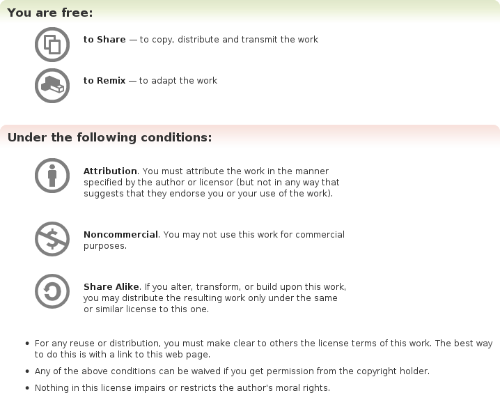

第三章 清晰的沟通
在我开始演讲之前，我先说点更重要的。----Groucho Marx

当我还是11岁的时候，我的朋友从他哥那顺了个LP，他找我拆开那个包装，我们用白塑料袋重新包起来，拆开后，我生平第一次见到了真正的金属全新唱片。我一直听这个唱片，一直到它被听坏。我喜欢这个玩意，它的颜值（封面，我不是小孩），我想成为录唱片的人，不过，我没什么天赋，也没有成名，仅仅是个卷发和白袜男，自此，我决定开始学习玩吉他，我的父母给我买了一个旧吉他，我日夜练习，幻想会成为摇滚明星，尽管我只是个11岁小男孩，但我沉迷于此，结果我卡壳了。随着年龄的增长，我的吉他技能也有很大提升了，我阅览了很多音乐书籍，吉他谱，我喜欢你的乐队。有一次我看吉他杂志的时候，看到一句话，记得是Eric Clapton，不是很肯定，不管是谁了，他的话启发了我。

不是你演奏了什么？而是你没有演奏的东东。

虽然我现在还在搞很多音乐，不过这句话并没有真正提醒我，直到5年后我开始写作，这句话隐含的意义是，虽然我们痴迷于艺术形式的显著构件，但更为有价值的是它隐含的含义和传递的信息。比如，没有演奏的信息，这个对于社群构建也非常有用。
社群是完全关于理解他人的，我们的记录是过程，管理，工具，方法，确保我们一起工作，这里没有记录或者提出的是我们如何把这些都汇合在一起，并且共同分享，记录的空间是沟通。

他说，她说
沟通时社群的基础，有个比喻是告诉公路连接了乡镇和世界的人们。有效的沟通帮助我们社群以一种免费，高效，可接入的方式聚在一起，你需要花点时间构建基础设施，流程和管理。但是如果成员间不能相互有好的沟通，你可以打包回去找份The Love Boat的餐厅服务员的工作，公路和城镇很像我们通过频道来连接成员，为了保证我们的城镇能一起工作，我们手头有两个基本任务：

构建一条高速公路
首先，社群需要构架你基础通信设施的资源，用于讨论，点子分享，和最佳实践，在很多时候这些资源都是在线设施，比如邮件组，论坛，讨论频道。
鼓励和驱动
一旦你的沟通通道通了。他们就可以采用各种方式了，有好的驱动和不好的，有些会沟通的比较好，有些就会吵起来。你需要保证沟通的基本质量，这不是说把一些差劲的作者或者发言人踢出去，但也不是给大家一些安抚，告诉大家相互理解和感到开心。
本章我们会抛出这些话题，探讨构建免费沟通通道的媒介范围，如何使用好这些设施，增进透明，避免公共问题只说不做。那么，让我们开始铺就高速路，然后放些汽车，是时候开始构建社群的通信主干网了。

构建你的社群通道
我们将会形成一个list，列出重要的关注点

社群TODO list
* 确保小组可以清晰有效的沟通

好的沟通可以帮助实现很多目的，这个是你的成员能在一起工作，共享目标和愿景，构建社交关系的重要基础，它确保每个人都主航道上，同一个方向，同一个节奏。

好的沟通是一个强有力的安全伞，当沟通不好时，社群就散了。志愿者社群是被共同价值意愿驱动的，这些会在社群运作中定期加强，它很重要，社群成员更新换代，经常争论和吵架，最终脱离社群目标，当你的成员感觉已经和社群失去联系，他们就没有了价值意愿驱动。

沟通分为3大块：
对内
接收反馈和处理反馈信息，包括提升社群的凝聚力，比如调查确定我们社群是不是健康运作。

对外
分享信息，故事，完成的事情给社群外的人，比如展示你社群实现的东东。

内部之间
内部讨论和会议，包括目标，子目标，冲突和其他问题，比如社群设计决策会议。

这些沟通形式是社群的基本点，所有社群需要开放和客观的反馈，他们应该共享他们的成果和产品，最后，所有的社群徐亚欧定期的内部讨论和会议确保每个人可以顺畅的交互，好的沟通应该给社群的不同部分有不同的子目标，当我们运作好了社群，成员你会感觉充满生气的，蒸蒸日上的，易接近的，我们准备探讨这些话题，将在7,8章节详述。我们这里聚焦内部之间的沟通。

尽量清晰

因为沟通对于社群成功至关重要，而很多社群死在这里，他们搞了一个复杂的，啰嗦的，难以使用的沟通通道。还需要你懂得一定的编程才能接入，甚至还要求你有学校的计算机语言学位才能加入。还有很多是罄竹难书的，如果你不懂里面的道道，你就等着悲剧吧。
相应的，你应该构建简单的，有效的，受欢迎的， 更加欢乐的保持沟通的方法，好的沟通形式是经常面对面的在一个房间沟通，在这种条件下，你可以自由的畅谈，你的思想跟着你的语速，还有身体语言，手势，面部表情，对话等等，所有的沟通技术，都希望可以具备这些要素，当然，很多人面对面的情况将会消除沉默的部分，觉得不太爽，当确定好我们社群的沟通方式，我的目标是尽可能的清晰，想象一下，在一个清晰，可接入，良好的理解的沟通条件下，你需要仔细考虑沟通文化，确定好高速路和驾驶方式，首先你需要考虑透明和清晰的基本条件，你的成员可以听到，读到，使用各种沟通方法，当清晰性搞定了，成员就会很快适应，当混乱，误解，不透明形成的时候，你的成员将会花费数日寻求理清或者迷茫，迷糊和挫败，清晰和透明在吸引新成员时同样重要，比如，大部分在线社群的沟通通道是用搜索引擎才能找到，社群中你有几次是在Google上输入然后找到邮件组，论坛或者其他在线讨论的。潜在的新成员将会读到这些讨论，并且影响他们的选择，进而加入社群，如果沟通是复杂的，充满担忧的，或者其他不足的，潜在成员也许宁可在家玩吉他，也不会加入庸庸碌碌的大众。

清晰性需要注意两点，第一是构建媒介的选择，（邮件组，IRC,论坛等等），这个相对直接并且不是很有趣，我们后面讨论，第二是更复杂的部分，最大化的清晰条件下选择沟通通道，我们详细阐述。

选择，选择

你的社群有大量的通道选择，每个有不同场景，包含不同的人，目标是匹配正确的媒介，理解媒介的优劣势，去除劣势部分，选择一个正确的媒介需要理解你的成员和工作流。每种类型的成员有着不同的偏好，软件开发者一般不喜欢直接对话，他们喜欢邮件列表和订阅，不喜欢去网站看看是不是有更新，这也是为什么很多程序员不喜欢论坛的原因，一些成员将邮件列表内容放入论坛等等，比如Banshee项目（http://banshee-project.org/support）

注意
不少开发者也很喜欢论坛，最后一句话是基于项目和开发文化的普遍情况，特别是在西方世界。如果你知道有程序员喜欢论坛，不要告诉他，我们都是朋友。用户是不同的，用户经常喜欢论坛因为它简单并且易加入。

对话流是清晰的，接口是友好的，浏览器是熟悉的窗口，用户习惯于刷新浏览器看最新内容，一般讨论需要技术来找到内容和讨论信息，他们不喜欢一堆技术障碍，不然他们翻脸。
不管你信不信，这些人很顽固，尝试说服开发者就像尝试说服猫去追着棍子跑，开发者可能同意其中一点，但我保证你不会成功。
沟通通道是高速公路的惯例，人们有他们的偏好，分不开，在社群开始的时候，你需要什么样的角色和个性，适合什么沟通媒介，这是构建沟通通道的第一步，接着是你可以做个选择，我们将会阐述一些媒介，有些可以帮助你更好的选择。

盲目沟通
另外一个关键考虑点是构建有效的沟通通道时聚焦讨论，这是第二部分，避免盲目沟通。
盲目沟通在在线和技术社群中比较普遍，新的成员你希望提供沟通通道的可能性，他们建立邮件组，论坛，IRC，第二世界等，这是错误的，你要识别项目的关键角色和个性，选择这些关键角色舒服的媒介。

让我们看个例子，当我建立了Jokosher项目，我知道社群的基本角色是用户和开发者，我想保证项目的沟通通道是技术讨论，同时是音乐人讨论Jokosher，分享点子，展示作品的地方，我建立了程序员你邮件组和用户的论坛，这个媒介对应了程序员你和用户角色，另外的媒介我只创建了#jokosher IRC以便于实时讨论，和程序员的开会，尽管这个频道开着，我从没有把用户拉进来，论坛更适合用户。

流程第二部分是确保所有的关注点在一个地方，很多新社群犯的错误是让个人碎片化信息沟通媒介泛滥。让我们看另一个例子，当我们开始LugRadio，我想提供一个听众可以讨论节目的地方，论坛是最好的选择，所以我创建了。在部分讨论中，你可以有很多子论坛，比如，如果你有一个软件项目，你可以有开发子论坛，通常讨论，文档子论坛等，当我建立了3个子论坛后，通常讨论，节目点子，镜像。每个都有清晰的主题讨论，你需要推进讨论并鼓励其他参与者讨论，如果你有一个论坛有很多子论坛，你可以分块讨论，把有一些一致性的汇聚在一块，这样人们不用花时间选择子论坛，可以直接提交，最坏的情况是，大家都不知道选择什么板块提交。选择少的时候，可以让讨论加快。

媒介
随着我们围绕的最佳实践，让我们现在看下那些媒介是适合的，在前面，我提供了媒介列表和行为元素，在我们开始前，我们需要讨论选择有效媒介的关键考虑点，如何简便的记录和检索以往对话，当我们和他人在线交流的时候，每个媒介都有不同的方法找到这些对话，这些方法反过来调整了人们如何在媒介上交流。比如，很多社群都很有名，他们的邮件组有他们的对话并且在网上公开，网站可以通过搜索引擎搜索到，带着这个信息，邮件组的参与者们经常比较正式和专业，你不会想到你的对话会被HR看到，另一块是，实时的IRC聊天，当很多IRC频道创建后，很难找到日志和找到相关的讨论，因此，媒介感觉比较少记录了，很多参与者在社会上沟通更舒服了，你应该更深远的考虑构建你的社群设施，保证你的成员在意你的考虑，没有人希望，一些人说了点什么，假设这个没有实现，接着通过搜索找到他。

邮件组
邮件组是很好的媒介，低带宽，界面熟悉，易于接入，对话是直接通过客户端实现，对话的传递减少了新成员忘记社群的机会，每次他们检查邮件，就会感觉社群的存在，会看消息和回复，邮件组被程序员深深喜爱，在开源世界也一样，不少非程序员也喜欢，不过，邮件组也不是那么好，加入邮件组有点复杂，他需要人们知道怎么加入，邮件注册，回复邮件，知道哪里发消息，并且会被当成垃圾邮件过滤掉，邮件组假设你对多有话题都感兴趣，当你加入后，所有讨论都会发给你，这使得邮件组更适合社群的重度用户，邮件组的另一个问题是没有实时性，比如，如果你是一个社群的软件开发者，在晚上10点工作，在周六，你有个问题，你可以咋邮件组提交这个问题，但是你可能在周一或者周二收到回复，就是这个困境，如果你有更实时的沟通需求，像IRC这样的实时沟通通道是比较好的（当然，前提是人们在线上，沉默在什么媒介上都没用），正常的用户和消费者对于邮件组的心情是复杂的，很多用户有单点的查询和问题，复杂的注册过程和收到所有对话信息是不太有利的。

注意

一个重要的提示是建立一个邮件组需要考虑是不是可以在网上公开，如果希望保密，那么我们在第8章详述。

讨论论坛
论坛是非常流行的，低门槛进入的媒介，他们可以让你提交一个标识和基于和这个标识来讨论，以网站形式展示。

论坛在近些年比较流行，一些大的论坛，已经风靡全球，在我写这个时，世界上最大的社群是日本动漫角色扮演社群，有着1500万成员和10亿的提交。现在，规模都很大，就是LugRadio也有1000个成员和40000多的提交，论坛通常使用社群的在线支持通道，很多软件项目觉得很有用，包括Jokosher，论坛对于非技术用户很实用，易于接入和使用，很多论坛允许用户用阿凡达的头像，个人信息和签名，很多论坛也鼓励通过用户提交数来计算用户等级。很多用户对等级，排名非常重视，并且对于取得的地位很骄傲。

注意

小心这些等级变成了社群衡量的标准，它们通常不准确，我们在第8章讨论。

因为论坛的用户为中心的属性，讨论经常是新用户的提交话题，经常是一些规则的询问，这种情况下，你会造成一些信息冗余，你应该确保你有一些维护者来处理这些信息，最好的方法是吸引少量受尊敬的和值得信任的人加入你的论坛。

注意
很多社交网站，比如LinkedIn和Facebook，提供类似论坛的功能内嵌入网站，这个对一些社群很有用。

社交媒体
对于很多不同类型的沟通，社交媒体是比较大和可理解的，第6章详述它。

IRC
它是一个实时聊天工具，越来越流行，遍及世界，很多IRC网络有着特殊的目的，比如Freenode网站（irc.Freenode.net）特别是针对提供IRC频道和对话给开源项目，尽管是一个完全开放和可接入的媒介，IRC在技术圈一样流行， IRC的价值是实时讨论，还有很多好处。

绑定
社群通过实时联系显得有效，它提供了人们日常聊天的机会，不像邮件组那么正式，很多人用IRC社交和聊天，这使得人们紧密联系。

速度
IRC的讨论非常快，提供讨论和辩论的场所，通畅和易于辩论。

会议
IRC提供了实时会议的好场所，我们将在12章节讨论。

日志
IRC可以被记录，讨论和会议可以被记录下来。

如果你建立了社群，聚焦于技术或者互联网，IRC是比较有用的媒介，不过你的IRC应该是开放的，可接入的，公开的，你应该确保把它公开在你的网站上。

注意
很多IRC服务是被商业环境阻碍的，你的一些成员因为这个不能在工作的时候接入，有一些基于web的IRC客户端，可以解决这些人的问题，你需要一些社群网站来搞定它。
和其他媒介相比，IRC有着自己的特性，但是它的特性文件也是混合的，一方面，我们看到很多程序员每天使用IRC和社群联系，另一方面，我也看到新用户加入IRC，你应该确保这些用户分在不同IRC频道，如果你在运作一个开发项目，最好把程序员和用户分开，比如#myproject-dev和#myproject-users,一个有趣的技巧是你意识到了权利的欲望，很多社群发现重要的是IRC频道是可以控制的。

IRC允许人们成为频道管理员，这个权利可以踢人和禁言，很多社群有辩论，斗嘴时使用过这些招的经验，成为频道管理员对很多人来说是种荣誉，你应该在分配频道管理员权限时小心翼翼，是被那些谨慎操作的人。

不展示权力
在所有IRC频道，一些人可以成为管理员，有权力踢人或者惩罚他人，默认的，有一个图标标识了这个信息，很多频道一般不展示管理员，一方面，这个很敏感，如果管理员是隐藏的，那么频道会感觉公平，另一方面，有可见的标识会成为自我反省，因为这确保人们保持警惕，我的建议是，如果有人是管理员，让他不要显示图标，但如果有人需要被踢出，就切换成有特权的状态然后踢走他。

以例子为榜样
不管你决定了使用什么沟通通道和什么工具媒介，你需要努力使得社群友好，清晰，有效率。你应该使得你的社群成员不仅感到有责任，有激情，有担当，同时喜欢和他人互动。

这没有想象的那么容易，每个人都有不同的个性，习惯，观念，方法。这些细微的差别造成我们沟通的障碍，人和人之间产生纠纷，通常是预期的不匹配，互相之间的协议是不清楚的，气氛怪异的讨论，将一些不相关的事情，不仅仅是这些，人么你有时候会从床的一边睡到另一边去，每个人都有不开心的一天，因此混乱就发生了。

生活继续，人们很忙

很多时候这完全是无辜的，却也是人性，人们是社群的组成因子，你可以原谅他，在沟通中我们是无能为力的。
不见得。
社群是文化的承载，每个社群有它自己的规范，这些规范是社群领袖定义的， 比如你，你可以避免很多潜在问题。不仅可以设定好的榜样，同时启发更大的社群学习这个榜样。

你需要保持学习
不久以前，我在Ubuntu Developer Summit，忙于开这个会，开那个会，协调讨论，规划发布版本，处理其他的相关任务，一个下午，我的朋友Amber，它是社群成员，问我是不是可以和我平静的对话，，当然，这是不寻常的，也许不是那么安庆，我保持不打扰她，接着她分享了我在某些方向上有偏好，特别是会议上，她觉得我推进的有点急躁，急于预期输出和下结论，武断的得出问题的解决方案，我感谢她的反馈。

这些惊到了我，因为我感觉我在沟通中已经尽量保持均衡了，我们讨论了可能的原因，是不是我压力太大了，是不是不够耐心，她补充道，我不是粗鲁，只是有点太聚焦了，当我们继续讨论，我们找到了原因，权威的，就像很多创业，是非常紧张和聚焦的环境，有很多会议，没有人想浪费时间，每个人聚焦解决办法和最快完成，我意识到当Amber分享她的反馈时，我在社群大会上也用同样的方式做了沟通，重要的是，很多志愿者社群成员的惯例是不同于重要工作承担成员的，交付，度量和其他压力需要处理。

它是值得记住的经验，他教会我应该在不同环境调整沟通方法，并且对于学习如何成为好的沟通者和反馈是一个关键的材料和修正我们的行为。

以例子为榜样，我们可以把问题分解为2种。
日常沟通
日常的讨论，点子，辩论通过你的媒介来。
长期写作
长期的，需要深度思考的，写作的沟通方式可能更加有启发性，有建设性，并且直接传递给社群。
让我们来过一下这两块，探求最佳实践，技巧，以便顺畅沟通。

日常沟通
这意味着你用你自己的，适合你的方式来沟通，鼓励你的社群基于好的沟通的理念来交流，保证你的社群在日常行为中展现。生活告诉我们有了高质量的内容，才会有高质量的回应。好音乐经常启发音乐家，好的艺术启发艺术家，好的社群启发好的社群成员。

榜样的树立，你要以身作则，作为社群领袖，你需要设定你的自己为很开心的扮演行为准则践行者的人，这也是我们反复强调的， 要熟悉的知道我们狗粮的味道。

作为一个好的日常沟通者，并不是要成为好的作家，成为好的演说者，或者超人，好的沟通聚焦清晰，细节，目标的思考，高质量的交互。

教育好的沟通是复杂的，很多书都有涉及，不过，成为好的沟通者不需要刻意的学术练习，或者装成一个带银镜的学者，但是需要简洁，友好，直接的沟通。

为了搞定这些，有2步需要完成，第一，你应该对约定规则足够的熟悉，比如

清晰

经常尝试透明和清晰，使用听众熟悉的语言，尝试打破沉默，但是不要宠着他们，经常尝试发布你的信息给听众。

精确
抓住重点，不要啰嗦，能100个字说清楚就100个字，我们每天收到很多邮件，消息，电话，和其他垃圾信息，不要浪费你社群的时间，收到不必要的信息，如果你的邮件超过5分钟的打字，你可能就有问题了。（除非你打字极慢）

尊重

你要是和电脑结婚，但是尝试在尽可能短的时间内回复，如果你正忙，让他们知道你可能晚点回复，这样他们的预期就会被你管理，这个对于个人沟通适用，也对邮件组，论坛，IRC和其他公共通道适用，把你推到发送人的位置，说清楚，没人能够回答我的问题是因为我想做的是不可能的，我得去尝试其他事情，和 没人能够回答我的问题，尽管每个人都知道答案，因为每个人都很忙，那么我应该等待而不是放弃这个方法 的区别。它让你的社群更加友好，特别是对新成员和外部。

有趣
有一个人们常犯的错误是当他们受尊重后就开始装逼，变得特别，让你的个性释放吧，说的笑话，机智的评论，挖苦一下，社群应该是有趣的，这个是榜样的重要部分。

人性化
我们都是人类，都会犯错，如果你错了，就道歉，人们会赞赏你的诚实和正直。这一点在领导社群中非常关键，当走了弯路时，社群一样会支持你。避免防卫心理，这会让你陷入防卫游戏的死循环，这是糟糕的，有危害的。如果你心里坦荡，大方承认错误（就像你的雇主会少点激动），识别哪里出错了，尝试此次不犯同样的错误，让社群更自信的发展。

第二步是从他人身上学习，观察邮件，对话，电话讨论，其他互动等，在脑子里面回想，找出有启发意义的点，你可发现有些人就是更加清晰，精确，细化，他们就是你的榜样。

## 网络礼仪

在很多在线社区内，经常有一些技术文化规范，有些沟通惯例和方法，在线的也好，现实的也罢，请尊重这些网络礼节。

尽管你们基本熟悉网络上的基本沟通惯例，不过还是得注意特定社群的本次规则。

比如，很多社群用邮件组，作为私人沟通方法。在很多技术社群，当新成员加入后经常置顶帖子，一些成员会显得不耐烦。让我们用个例子说明，加入你现在在一个公共邮件组里面，你收到以下邮件：

>Hey All,

>I just wanted to ask what is the answer to Foo?

>Thanks!

>Bob

然后你回复的之后，是这样的：

>Hi Bob,

>The answer is Bar.

>Jono
>> Hey All,

>> I just wanted to ask what is the answer to Foo?

>> Thanks!

>> Bob

这个做法经常让人不爽，原因是在线讨论经常是一系列的消息回复，置顶让人很难跟踪这个帖子，下面是接着回复的另外一个回复：

>> Hi Bob,

>> The answer is Bar.

>>	Jono

>>> Hey All,

>>> I just wanted to ask what is the answer to Foo?

>>> Thanks!

>OK, thanks for the reply, Jono!

>Bob

这个回复让人无法跟踪了，如果有人在引用文字后回复，应该按照下面的方式来回复：

>>> Hey All,

>>> I just wanted to ask what is the answer to Foo?

>> The answer is Bar

>OK, thanks for the reply, Jono!

>Bob

虽然这看起来少了一些细节，但它很简洁。很多在线社群就是被这个问题困扰着。很少有社群把这个潜规则给文档化，很多旁观者遇到这个情况只有无奈。

需要把这些潜规则文档化，并在网站公布，如果你是新人，建议你在参与讨论前首先观察社群几天，这个会让你基础到这些潜规则。

##　避免主次不分

大量社群会犯两个共同的错误：被资源困扰和讨论死亡话题，后面一个问题就叫做过于关心细节和边缘的问题，而忽视主要问题。
在很多协作类社群，第一社群资源是建立一个邮件组或者论坛，对于新社群来说，激情满满，社群的新成员沟通时都很激动，每个人都踊跃发言，充斥着讨论。

随着沟通渠道的打开，无拘束的讨论就展开了，社群目标，规划，点子，想法，承诺等，社群都首次让大家一起high,你感觉世界就是你的，这些有激情的头脑风暴的结果就是有激情和梦想的规划和点子，只需要把它们实现，是不？

不过，这没那么简单。
说说总比做容易，讨论一个点子，远远比实现这个点子容易。邮件组里面会有大量的讨论，这些讨论本身就会影响你的计划的实施，尽管预先的说明能帮助社群构建些什么，不过过度的预先说明和信息泛滥会起到反效果。

部分问题成员过分聚焦于每个点和每个面上，但是活还没开始干。这个有两面性，首先，太多的讨论导致计划复杂化，如果没有文档化将很难跟踪。这对于一些喜欢有趣和有序的成员来说是感觉不好的。当你过度讨论和设计一个点子时，复杂性就会让人气馁。
第二个问题是，在社群早期阶段，新成员需要看到成果，否则他们就会感到厌烦离开社群。好社群总是构建一小撮的能力，快速启动干活，快速进化。如果社群花了3个月时间讨论一些点子，但是没什么产出，很多潜在成员就会不耐烦，进而萌生一种感觉，这个社群就是个聊天室。这是我们需要避免的。有两种办法可以避免问题发生。首先，避免每次讨论的太细，确认谁干什么事情，什么时候完成，能提供的帮助。比如，如果你在软件项目，你应该在一周内写出一些代码，盯着目标，无论是软件，大会，比赛，等等。另一个办法是构建一个实验室文化，引导社群成员开始一些具体的项目，以便日后可以用得上。这个在GNOME桌面社群中经常使用，很多开发者工作于自己喜欢的项目，这些项目构建，发展，修正，当他们成熟的时候，就可以放入主分支。这个方法对于协作工作非常有效。

>    构建一个我能的文化

> 当社群新成员加入的时候，给自己设定合理的期望是非常重要的。

> 大部分人加入社群是积极的，但是永远都是说的多，做的少，这是很正常的，你应该期望大家都是实际行动会比说的少。你需要构建一个我能做的文化，激发成员让事情发生，积极的宣传你的目标和鼓励每个人贡献他们的输出，不管这个贡献有多大。

## 长期持续写作

除了日常讨论，邮件，在线聊等，好的沟通需要长期持续，深思熟悉的文章。这个长期写作通常是在多个地方，包括：

### 博客

博客不仅是个人发布媒体，还是社群发布媒体，你应该写文章，故事，社群的各种。

### 邮件

很多社群领导发送经过深思熟虑的邮件帮助指导社群运作。

### 杂志文章/网站文章

你的社群很可能会被杂志/网站看重，你需要发表你的想法。

### 文档

社群产出文档，指南，帮助等，这些需要清晰的写作和易读。

好的写作包含基础和文风来部分，你首先需要掌握书面语言，然后用词汇，短语，段落串一起，让人们易于阅读。

让我们看下这些话题

## 写作基础

好作者的第一步是掌握基础，包含拼写，语法，标点。
对于一些人来说这是沟通的终极目的：通过编辑指引输出完美的写作。用我们之前的话语：不是你演奏了什么，而是你没演奏什么，写作的基础是我们隐喻的记录。尽管这不是终极目的，写的正确是最基本的，拼写和语法错误，再好的修辞也没有用。要掌握这个基础，我建议你读一读这个话题的书，有很多选择，不费你多少时间，拿起一本书，理解它的主要观点，摘取它，使用这些建议。这里有一本书值得反复读，就是Strunk and White的经典 The Elements of Style (Longman)，当你阅读该书的时候，也读一读其他书籍，看看什么因素决定了该书的有趣性和易读性。如果要我再给一条建议，那就是经常校对你的输出。校对帮助我们发现结构是否合理。让我们以本章为例子，如果你看一下内目录，这是非常有意思的，在我写到这个章节的写作基础时，我还是会去校对这个内容是不是和整体章节对应，并且保持了前后的连贯性。

很多人写作，会先写一些概要，树干，然后写作过程中校对这些概要。这非常好，不过我会在校对前加一步，大声朗读这一小节。虽然这相对默读很疯，但是大声朗读确实对于找出错误语句（不流畅）很有效果。

> 写作中的不同文化

> 有个注意点需要关注，世界范围内写作中的不同点，同一语言也有不同，包括拼写的不同（color 和 colour, prioritise 和 prioritize），同一词汇的不同意义等。

> 主动和被动的不同，有些国家用被动语态，“Today this was done by the group”，有些国家用主动语态“Today the group did this”

> 你应该使用是适合于你的受众的语态，如果是一个开放的受众，坚持使用你的方式。

## 不要写的像是公文

当我上大学的时候，我习惯于写一写Linux和技术的文章，这个工作让我的职业发展的很好，工作以后也持续保持写作，每天我给不同的杂志社写文章，这个时期我关注于不同主题的不同方式，尽管我的研究是基于在线和电话，但是我的大部分个人时间花在了新闻发布会。
新闻发布会是有趣的，有着一种模式，我们出版社会发布一下对社会的不满，市场就会发布一些对世界乐观看法。他们养着出版社，不仅仅是通过咖啡和香肠，而且还有一堆市场废话。

我的记者生涯经历了很多类似的概念和主题，辞藻华丽的宣传语，一堆对于技术媒体无用的信息。
最好的例子是一家机构发给我他们新的出版计划，那时我正在喝着早茶，看到下面的宣传语：

>Program Focuses On Helping The Open Source Ecosystem Grow Sustainable Businesses By Implementing A
Community-Leveraged Model

这还没结束，

>XXXXXXXXXX, a leading provider of commercial open source middleware solutions for database high availability, today announced XXXXXXXXXX. The program is focused on creating a rising tide for the broader open source ecosystem, and is focused on leveraging community-driven development and frictionless distribution to extend the ecosystem.

这个描述冗长而无意义，很多公司通过出版社发送这些废话到我们邮箱，包含简介，产品介绍等等。

当然，有目标的写作经常是针对特定受众和对应的语言，他们饱含意义（特别是商业和买家），不过，在很多时候，还是饱含的大量的言之无物的信息。你应该注意不要掉入这个陷阱，如果你掌握了社群的话语权，你就面临迷惑群众和让人们不安的风险。记住，社群需要透明和清晰：如果讲话总是类似广告文字撰稿人，你的成员就会把你的言论理解为迎合群众。用你的自己的方式来表述，就可以避免此类问题。你如你是一个社群经理，需要向市场部门汇报，这就是一个挑战。应该把它看成你的职责，扮演技术和市场的翻译者。

有名的写作老师，William Zinsser在这个话题上有详细的描述，On Writing Well (Harper Perennial)，一本关于清晰写作的书籍，当我开始写此书的时候，O’Reilly发给我这本书。一天下午我在阅读这本书的时候，有一段话击中了我：

>就算人们为机构工作，他们也没必要携程公文一样，公文也可以有温度，官员也有人性，信息可以使平实而不华丽的。记住人们面对的是人，不是抽象的概念，比如盈利能力，或者拉丁语利用和实现，或者言之无物的语句“可行性研究正在概念阶段”

Zinsser主张清晰写作，他认为写作的敌人是一定要把平时的话语写成专业术语或者无意义的词汇显得更专业。前面，我们已经讲了“不是演奏了什么，而是你没有演奏什么”，专业性就是你需要演奏的东东，言之无物的词汇就像你把手放在钢琴上只为获得关注一样。

## 解开尾巴

当我下马的时候，我意识到把复杂的流程和概念用简单的语言讲出来（不会误导人们和言之无物）非常的难。

虽然我不想把本书写成一本写作书籍，但是这里有个例子可以说明将复杂事情简单化：许可

Creative Commons是一个免费许可的组织，是法律专家Lawrence Lessig创建的，Creative Commons已经取得了巨大的成功，成千的艺术家已经使用了这个许可，音乐，视频，艺术等，每个许可都增强了所谓的自由文化，自由分享，混搭，继承自已有的成果，许可的范围给出了不同层级的自由度。

创作自由许可是Creative Commons赐予的礼物，但更为重要的是，他的许可易于阅读，例子是Creative Commons Attribution-NonCommercial-ShareAlike 许可，本书也是基于这个出版的，图3-1展示了许可的样子：

图3-1 Creative Commons 简化了许可的描述

以往，许可都是丑的一逼，它们不考虑可读性，包含大量术语，让想使用它的人迷惑。

Creative Commons终结了这个历史，图片给出了许可的基本要素，易于，可视化。这种方式让创作者更加易懂。
如果许可难懂，创作者就会（a）不用这个许可（b）更担忧。用了一个他们自己不懂的许可，将来可能会有麻烦。

为帮助许可可以使用，Creative Common提供了2个文档，一份是含有各种术语和废话的版本，如果有个案子上了法庭，就可以那这份去审判了，这个文档是专用于法律的，不是给创作者的。因此，Creative Common将3000字的文档转化为图3-1的几句话，这个版本让人们易于理解，堪称清晰和目标写作的典范。

Zinsser的观察（不要写的像公文）对于文档化你的社群，非常重要，特别是社群的流程。当你要编写社群需要的文档时，不要堆砌一些毫无意义的词汇，过度复杂化的描述等，以Zinsser的建议为例子，让写作简化，易读，从受众的角度编写。简洁帮助你的社群做出伟大的工作。

>我，我自己，我

>一个好的写作建议是写作的时候就像和老朋友或者同事对话一样，这种轻松而清楚的方式使得读者感觉舒服和吸引。此法加上大声朗读和校对，让你的写作具有灵性

## 设定语调
语调是写作中的重要因素，它人们从中获得的感受，是微妙和主管的，比如
有两种不同的要求人们汇报工作进展的例子，语调上完全不同

语调1

hi，各位！随着我们社群持续成长和影响力提升，我们一起工作面临着诸多困难，因此，我想通过大家一起来写一下各自的工作进展以便我们相互了解工作情况，它可能花费你数分钟，但是这对我们整体来说意义非凡。想一想：）

语调2

hello，大家能不能写一下工作报告以便促进社群了解工作情况？谢谢！

语调1是开放的，友好的，吸引大家参与的，语言轻松，开放式的询问大家的反馈和意见，语调2就太正式了，有点强制的感觉，虽然两种语调都清晰表达了，但是词语的选择影响了语调，语调在写作中很重要，接着我们的引用注意你做了什么，最好的例子是注意你没做的，语调的选择极大的影响了最终的理解。

写作中语调有2点需要考虑：

通用语调

在你的社群汇总应该考虑通用语调，对大多数人说，你的语调表达了你的思想，这个也影响你自己的个性，应该尽可能使得你的语调轻松，开放，友好，受欢迎，适当的加入一些幽默，促使你的社群感觉到公平。

上下文环境的语调

依赖于上下文，应该使用恰当的语调，在处理冲突时，人们激动的场合，管理主题时，就会有所不同，你选择的语调影响了你对社群的感知，需要做到平衡，尽管快乐的，愉悦的，脾气暴躁的产生的效果是一样的，想象在你面前有沙堆，有条线，线左边是活泼的，欢快的，有好的和笑脸，线右边是脾气暴躁的，单调的，悲惨的，武断的，尽管很容易知道右边喋喋不休的讲话，但是左边的人们隐含烦恼和不信任感，如果某人过于展现快乐于人前，这说明此人是哗众取宠的，这种情况下，就需要有个平衡了，做自己，线条左边的错误，就像我们对友好的朋友的喜爱，使用你最好的判断坚守你的底线，在语调领域，很多不同的人用不同方法，一些人做得好，一些人很LOW
纽约投资银行家把这个事情讲的很清楚。

让我们看下资料，看是不是有适合你的语调以及这些语调的影响：

严肃

在不同的场合面对的严肃的反应，社群中是不一样的，作为通用情况，应该确保社群保持轻松和愉悦的环境但有些时候需要更为严肃，比如冲突处理，管理议题，人员管理问题等。

幽默

正确使用幽默在社群中会带来正面效果，如果你是个有趣的人，社群中的人就会被传染，但是你的幽默应该确实是有效的（你确实是有趣的），还有就是过程中不要让大家分心，你应该确保你的幽默适合当前的场景，比如在紧急会中幽默就像灌了铅的气球。

智慧

和幽默紧密相关的是智慧，如果你是有急智的，特别擅长搞笑，它能帮你构建一个轻松和有趣的氛围，有一个风险需要关注，不要使用你的急智使得社群窘迫或者尴尬，同样，智慧也不适合有异议的或者辩论的场合，小心使用哦。

坦率

坦率说到点上可以被很多方式接收，一些人接收到坦率后会防卫或者对抗性语调，但是大部分人会欢迎你的坦率，触及谈话对象的心灵，根据他们的反应调整语调，你的选择和方法都会不断适应，成长和成熟，观察其他人的沟通方法，对我们如何和这些人沟通有着重大的借鉴作用，举个例子，如果你正在处理有异议的事情，观察他人的反应和学习他们，你也许可以事先和到场的人合计合计，问问他们的意见，我们在11章展开

有时候我们可以自贬一下

有一个有趣的方法是自嘲，这个做为领导是很有用的技巧，当领导向自己逗自己一下，可以获得他人的积极反馈，一般情况下你只有感觉合适的时候用它，假装自嘲很容易变成装逼。

## 激发你的社群

社群的最基本质量是社群的领导能够激发社群成员。在领导的心里，社群是为了共同信念，目标和机会联合起来的一群人，不仅仅是让人们注重承诺和对目标有激情，而且构建一个集合协作的氛围，这个是兴旺社群的本质。

不过，并没有固定的公式和套路可以照搬。激励是一个复杂的课题，它取决于你的方法和你所在的社群，还有一部分原因是激励本身和你自己有高度依赖关系。激励成功与否，基于你是否对信念高度信任，你的方法折射出你的认知，比如，你是一个有趣，天性快活的人但是尝试模仿丘吉尔的独白，这就是个搞笑的结果了，反过来说，如果你是个严肃而直率的人，尝试模仿George Carlin风格的戏剧表达，你的受众就会感觉他们的爸爸在婚礼上跳舞，你需要识别适用你的个性的方法，当你自己能够激励自己的时候，那这个方法也可以激励他人，最好的建议是找到什么人或者什么会激励你，然后学习到这个方法，每个人有对这个问题的不同答案，有些人是被音乐家，作家，政治家，工作领域的兴趣点或者经历所激发。对我来说，最激励我的是Aaron Sorkin和Martin Sheen的独特组合，Sorkin是The West Wing的剧作家，The West Wing讲述白宫的管理，我每次看这个秀的时候，我被这个对话所吸引，我喜欢他们的说话方式，直接而带着幽默，因为是他们的重度粉丝，我有他们每期的DVD，这些磁碟有很多激励的例子，和总统的信息传递方式。我看过后，自己的说话方式就有所改变，写作也有变化，它启发了我。应该客观的看待，The West Wing是一个写作团队每天花时间写的，对我们来说不能中毒太深，一旦你找到了你的激励点，提取它，找出什么才是启发了你，但是只是作为一个参考，不要指望一天变成Aaron Sorkin，聚焦于学习目标，共享想法，使用它，观察社群的反馈。

找出你的启发点

花点时间想一下哪里是会促使你思考和想出点子的，有些人是在洗澡的时候，有些是躺在床上的时候，每人都不同，所有人都有感觉受启发和创造力的时候，下次你感到受启发的时候，记录你在干什么，找到关联关系，当你找到了，就像开动了开关，获得你的高质量启发时间。

## 总结

回顾本章，我们探讨了构建一个简单，有效，有创造力的社群文化的众多课题，尽管这些课题是基于沟通的最佳实践，实际上也应该注意到有效沟通是需要实践中获得经验的，接着沟通最佳实践的一系列的方法，让我们继续讨论构建简化社群的复杂课题：构建流程。
系好安全带，我们出发。
