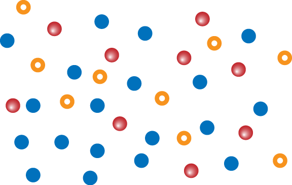
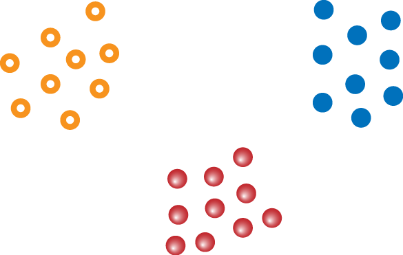
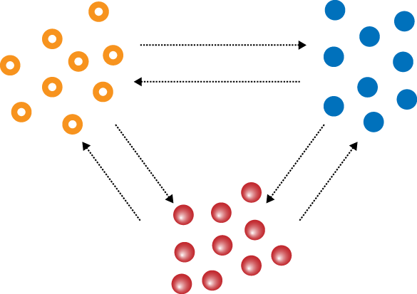
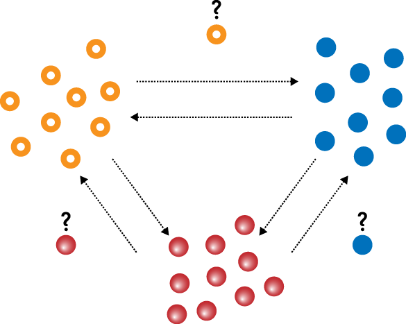
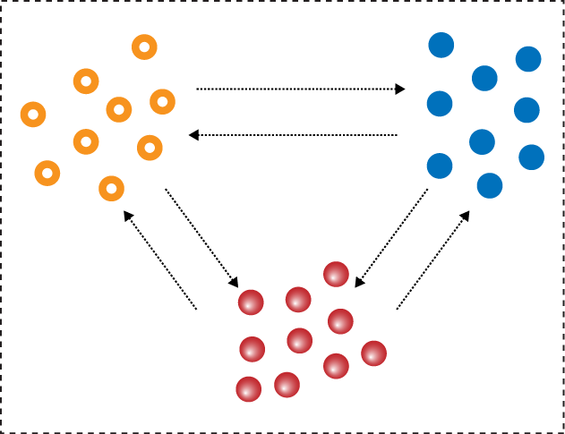

# 社群的规划

>我们必须团结在一起，否则我保证我们会分裂。
---Benjamin Franklin

我最好的朋友是一个叫做STUART LANGRIDGE 的人，我叫他Aq，（他的网名是Aqarius，在一个在线科幻作者群组里面，当他解释这个名字的时候我关注了他）
我第一次见Aq是在英格兰的wolverhampton(伍尔弗汉普敦大学),我正在上大学，我们很快成为朋友，带着我对Neil的linux用户组的好奇心，我急于组建我的群组，开心的命名为伍尔弗汉普敦大学linux用户组，六个月之后，Aq参与了一个会议，完全和现今的个人商标媲美。

从此之后，Aq和我共享了很多牛奶和咖喱，我们讨论自由软件领域可以想见的每个话题，几乎无所不及，我们激情的讨论每个主题，我们同样花时间找证据证明对方是错的。

这些辩论启发了很多的项目，其中一个是LugRadio，纵观LugRadio的过程，基本上是我和Aq的辩论历史记录。
随着固定的背景音乐和四人组合，充满录制设备的房间，我处理录制和编辑，使用max os x和cubase音频处理系统，是的，就是你读到的， LugRadio是一个全部关于自由软件的秀，但是录制在私人的系统中，用着私人的应用程序，幸运的是，社群每天提醒了我所谓的自由的讨厌需要替换掉。幸运如我。

不幸的是，我不想花费我的时间在linux音频工程师的科学领域，我喜欢玩音乐，不是花时间在把软件设置在一定的大小范围内的工作。

这个辩论迅速流行，我已经逐步讨厌这些讨论，有些事情变味了，一天晚上我们在Aq的屋子，我们正在喝茶和讨论开源，就像往常一样。

我和我那爱吵架的朋友分享了一个新增的话题，对于交互设计很感兴趣：如何使得产品和接口更加易用，这样linux音频录制的想法就更加深刻了。

我们讨论的非常尽兴，我们同时提到了接口设计难用的例子，交互的方法有着冗余的问题，依赖复杂的背景知识，以及其他一些类似的例子，我的想法是先开始尝试一下，因此我们开干了。

我们想到通过音频录制就会很有意思，我们用笔画了画，还有茶，讨论到凌晨4点，当我回到家，拖着我疲惫的身躯上床睡觉时，我的电脑包装了三张对于音频录制的总体方案图。

尽管我们只是头脑风暴，并没有时间记录下音频的知识，我们是用我自己简单的音频程序和开发技能来录制尝试，但是没什么卵用，我实在太忙了。
虽然没有时间和技能，我不想我们的想法毁于一旦了，因此我草拟了草图和一些博客想法，我通知LugRadio社群和期望的沉默：世界在变，我们的设计没有受到关注。
几周之后，我进入LugRadio论坛，结果一些代码已经提交到库上来了。我下载了，看起来点样子，虽然很简单，基本上是我草拟的一些东东的接口实现。

我瞬间石化了，Aq也是。

作者是一个叫做Jason Field 的家伙，对于linux和代码很有激情，我马上就联系了他。

他的小小贡献启发了我考虑了项目的将来，并且看下是否涉及是可行的，他说是，LugRadio社群成员完全被新音频编辑的事情激起了兴趣，他们的网名是JonoEdit，虽然有些尴尬，但是我很高兴。

是时候让机器运作起来了，我们启动代码库，一个网站和邮件列表，一个bug跟踪系统，计划跟踪会议。我们组织了黑客日，抓bug派对，在线的计划讨论，一些关键架构设计决策，新人加入了我们的团队，包括Laszlo Pandy，后来是这个项目的经理，在开发后期，项目变了名字，经过意见收集，Steve Parkes（LugRadio初始播音者），建议取名Jokosher，取自Jo和Kosher，意义是没有Bacon，包含了名字，在此，我石化了，但是我们团队喜欢这个名字，因此我们用了这个名字。
每个人都很努力，我们深夜在写代码，调试，bug修复，写文档。
我们构建的不仅仅是程序而且还是社群。
我们发挥了协作并且形成了团队，里程碑事件，大约一个月之后，我们第一版本发布，从一点想法，到我表述的一点业余设计，我们交付了人们能够用的东东。现在，虽然我已经在干其他事情了，Jokesher同样是一个活跃的项目。

大部分自由软件项目是从一个人开始的，觉得某个地方有痛点，因此他开始写代码和发布，如果代码解决了其他人的痛点，并且其他人很感兴趣，那么联合作战就开始了。

Jokosher是不同的，它在软件成型之前有纸上的思路，这个应用程序的痛点在于交互设计的新方法，因此有一个设计文档是关键。

设计和完整的接口规格是构建这个软件的关键参考。

这个经验告诉我们（偶然获得的经验），社群的兴盛和成功有一个直接的相关策略，结构和计划，就算是一个模型也可以帮助驱动进展。社群更多的是通过事件驱动多于通过目标驱动，目标驱动通常会比较缓慢和成熟。

有组织的社群能够繁荣主要是组织结构提供了价值观，信念和监督。

战略可以使得此事发生。

>从一个产品的角度，我们把用户作为利益共享者，我们鼓励和促使用户定制化firefox，并且参与测试驱动和提供反馈。

>---Mary Colvig 关于策略

## 向着成功做计划
随着你在本书的阅读，你会发现我喜欢用特殊的方式来介绍概念，首先我发表一个高级顶层优先级的讨论和获取基本信息，然后我聚焦在细节，抛出主题，这个方法帮助我们介绍主题像是一个阳光的日子里把你放到一个温暖的泳池中，而不是把你扔进芬兰的寒冷的河水中。

本章的目标讨论如何制定社群战略。
我们首先看一下社群的四个基础部分，每个部分包含我们接下来本书要包含的细节内容。
基础部分的内部是团队，社群的血管，我们将在接下来阐述如何工作，接着我们定义使命，目的，目标，放入最终的战略规划中。

我们将会覆盖很多范围，篇幅大，因此可以先准备茶，或者Hobnob，舒服的看下去。

通过讨论的这些方面，我们需要抓住关键概念，并且牢牢掌握。

我们很同意就会忘记或者忽略社群成长的重要方面。

为了简化，我们放到TODO lisrt
>* example item           
>* example item
稍后我们将会回顾这个列表，用它来组织我们战略规划的基本要素。

### 社群：鸟类的视角
构建一个强大的社群是令人高兴并且觉得值得投入，但是要实现它比较复杂。

你只需要看看本书的目录内容就可以知道主题非常多样和繁多的，

我们首先返回去理解我们的目标。
当我们醒来，决定我们需要构建一个社群，我们需要完成什么？

抛开社群本身的目标，它是构建一个软件项目？还是改变一个政治系统？或者其他？我们如何汇集一帮人团队在一起干事情？如何组织？好了，我们需要详细阐述如何干。。。。。。一点

是的，一个点。

我知道你在想什么：你疯了吗？Bacon。

一个点很同意吗？当然，但是他们有不同的方式。

不同的颜色，不同大小，不同的形状。

你可能不知道这些，但是每个点都有它的个性了。

看下面的3个点

点的大家族，他们可爱吗？

读者们，我要介绍给你点的大家族，John，Pauline和Ken。
尽管他们很像，但是每个点有不同的个性和技能，他们聚在一起是有共同的使命，构建完全新的和原始社交网站，通过这些点构建，给这些点构建，叫做DotBook。

John，Pauline和Ken有不同的角色分工，John（左边）是程序员，Pauline（中间）是文档工程师，Ken（右边）是美工，我知道，它更像是个艺术类型的，John，Pauline和Ken并不孤独，在互联网上有很多这样的点。

问题是，就像你看到的图2-2，所有的John，Pauline和Ken，以及他们的专业技能没散落在网上。

图2-2 点并不孤独。

他们相互并不认识，他们为了同一个目标聚在一起，但他们并不是在一块工作的。

一个社群就是图2-2表示的一样，是一堆分散点集合，我们的第一个目标是从互联网上把他们聚在一起。

这引出了当Johns能够和其他Johns对话时，一些有趣的事情会发生，这个团队是兴趣和专业知识的聚集地，并且团队在社群中，就像图2-3

图2-3  通过兴趣和激情联合人们，是构建强大社群的第一步。

如果我们把社群看成事实基于共同兴趣的散布的点的组合的话（比如抗议一条荒唐的法律，讨论一个主题，构建一个操作系统），团队一般是基于兴趣或者技能集（比如辩护和文档）的典型小组，他帮助兴趣分享的推进。
举个例子，Ubuntu社群有个共享兴趣组是构建一个自由软件操作系统，为了干这个事情就会有很多小组如翻译组，打包组，文档组，测试组，宣传组等等。

这就是我们需要构建的小组，把社群分解为几个小的。更容易管理的小组。

每个团队完成社群宏伟目标的一部分。
团队小组就是社群构建的基础，他们不仅仅是社区内成员的相加，而且是帮助你组织社群和战略理解的同一单元的能力，从而找出他们有什么组成。

当John点找到了其他分享兴趣的点，他们相互认识后很激动，团队小组成了归属感的集合。

虽然团队具备基本的关注（典型的是一项技能，就像艺术或者文档），你不应该死板的关注那一点。

每个小组具备同一兴趣的人，但是这个小组的人同样可能具备编程能力的人。

他们能够加快美工贡献的实现特别是应用程序的技术开发环节。

同样的，鼓励和乐观对于社群成员聚焦在小组的技能上，并且庆祝你的团队成员有着多项技能。
小组提供构建强大社群的机会和收益的财富，我们将在后续讨论它们，让我们看一下这个目标的TODO list：

> * 识别如何将社群分解为多个小组。

尽管小组是有价值的，但是这还不够，作为一个单元功能，小组只是社群为实现共同目标的其中一部分。

我们需要保证我们的团队保持一种完全的拼图玩具游戏。
沟通，点子，故事在你的小组 中应该顺滑的流动。

就像图2-4

图2-4 小组间的沟通是基本

小组之间的沟通流是比较复杂的，超越你的想象。

如何保证小组（聚焦于社群的不同部分）之间的点子和流程顺畅？
你的美工小组和开发小组沟通顺畅吗?
这是一个大的命题。
就算是三个小组就像图2-4，你怎么沟通？你用什么工具？
怎么处理时差和地理位置？
如何回报交付给大社区内？
如何跟踪过程？
如何理解不同小组的共同工作？
都是难题。

这些问题不仅仅是2-3个小组的沟通，他们需要遵从整体社群的习惯，小组如何组织的标准，如何行为的标准，如何沟通的标准。

就像我之前提到的，虽然你的小组有着基本的技能聚焦（比如翻译），小组中具备很多其他技能的人，很多人是跨小组的，我们你不仅仅要培养小组间的沟通（比如正式的会议，过程的检查，沟通介质的共享），而且需要把具备多项技能的人用起来。

他们就是使得小组沟通的粘合剂，这些人应该在你的圣诞卡列表中。

这个主题是管理的部分，是非常大的课题，对于社群成功很关键，我会在第10章阐述，让我们在TODO list上做个记录，尽管我们不会在接下来继续讨论这个东东。

>* 识别如何将社群分解为多个小组。
* 保证小组之间能够清晰和有效的沟通。

下一个我么你关注贡献的增长，我们喜欢点，就像John，Pauline和Ken，我们希望鼓励他们加入我们社群，就像图2-5

当有新成员加入时，我们有两种诉求：
容量和多样性。

关于容量，我们的目标时提供更多的帮手，更多人可以办成更多的事情。

很多社群有着夸张的目标哦（我们稍后会讨论），而这些目标超出他的资源承受能力，这个瓶颈会导致社群崩溃瓦解。（我们在11章节详述），但是更紧急的是他急需更多的资源。

吸引成员到社群是一个任务，但是吸引不同种类的成员进来是完全不同的事情。
尽管这对于社群不是关键的，但是多样性有着巨大的价值，不同技能，文化，愿景，态度，经验促使社群的经验丰富。

图2-5 吸引新成员是基础任务

在后面的第17章节，我们讨论如何让成员进入社群，不仅需要社群有足够的吸引力，而且能够提供社群成员有效的工作流，这样可以让成员免受打扰。

你的社群成员在工作中面临什么挑战？
如何减少加入社群后学习这些新技能的障碍？
什么是好的技能？
让我们加进 TODO list

>* 识别如何将社群分解为多个小组。
* 保证小组之间能够清晰和有效的沟通。
* 吸引多样性的成员加入社群以实现我们的目标。

最后重要的一步就是构建一个正能量的环境，图2-6

我们将在第四章中阐述强大的社群环境，你的社群应该感到受到鼓舞，鼓励，为目标和梦想而激动。

图2-6 构架一个强大的环境，你将有一个强大的小组。

环境在我们的工作中扮演了重要的角色，每个环境
